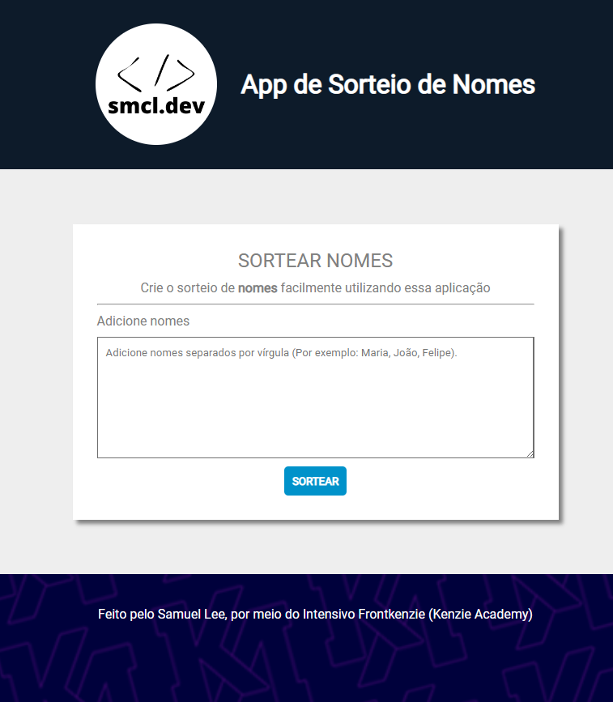

## App de Sorteio de Nomes

Projeto construído no evento Intensivo FrontKenzie da Kenzie Academy.

O aplicativo consiste em um sorteio de nomes, onde os dados são coletados e feito uma seleção aleatória retorna o resultado.

🔗 [Clique aqui para acessar](https://samuelmcl35.github.io/app-sorteio-nomes/)

## ⚙️ Tecnologias

- HTML
- CSS
- JavaScript
- Git & GitHub

## 📠 Contato

E-mail: samuelmcl35@gmail.com

Cel.: (11) 966424404
